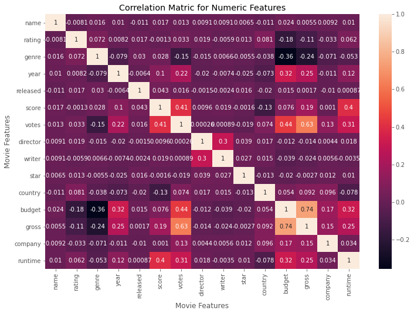

# MovieCorrelationProject
This project will be working in Python to find correlations between variables.  
We would like to figure out what factors are most correlated with the gross revenue of movies.  
First of all, we preprocess and clean the data. Then, we make an assumption and test the assumption by analyzing and visualizing the correlation between variables. Finally, we draw a conclusion that the number of votes and the budget have the highest correlation to gross earnings.  


```python
# Import libraries
import pandas as pd
import numpy as np
import seaborn as sns

import matplotlib.pyplot as plt
import matplotlib.mlab as mlab
import matplotlib
plt.style.use('ggplot')
from matplotlib.pyplot import figure

%matplotlib inline
matplotlib.rcParams['figure.figsize'] = (12,8) 

# Read in the data
df = pd.read_csv('movies.csv')
```


```python
# Look at our data
df.head()
```


<div>
<table border="1" class="dataframe">
  <thead>
    <tr style="text-align: right;">
      <th></th>
      <th>name</th>
      <th>rating</th>
      <th>genre</th>
      <th>year</th>
      <th>released</th>
      <th>score</th>
      <th>votes</th>
      <th>director</th>
      <th>writer</th>
      <th>star</th>
      <th>country</th>
      <th>budget</th>
      <th>gross</th>
      <th>company</th>
      <th>runtime</th>
    </tr>
  </thead>
  <tbody>
    <tr>
      <th>0</th>
      <td>The Shining</td>
      <td>R</td>
      <td>Drama</td>
      <td>1980</td>
      <td>June 13, 1980 (United States)</td>
      <td>8.4</td>
      <td>927000.0</td>
      <td>Stanley Kubrick</td>
      <td>Stephen King</td>
      <td>Jack Nicholson</td>
      <td>United Kingdom</td>
      <td>19000000.0</td>
      <td>46998772.0</td>
      <td>Warner Bros.</td>
      <td>146.0</td>
    </tr>
    <tr>
      <th>1</th>
      <td>The Blue Lagoon</td>
      <td>R</td>
      <td>Adventure</td>
      <td>1980</td>
      <td>July 2, 1980 (United States)</td>
      <td>5.8</td>
      <td>65000.0</td>
      <td>Randal Kleiser</td>
      <td>Henry De Vere Stacpoole</td>
      <td>Brooke Shields</td>
      <td>United States</td>
      <td>4500000.0</td>
      <td>58853106.0</td>
      <td>Columbia Pictures</td>
      <td>104.0</td>
    </tr>
    <tr>
      <th>2</th>
      <td>Star Wars: Episode V - The Empire Strikes Back</td>
      <td>PG</td>
      <td>Action</td>
      <td>1980</td>
      <td>June 20, 1980 (United States)</td>
      <td>8.7</td>
      <td>1200000.0</td>
      <td>Irvin Kershner</td>
      <td>Leigh Brackett</td>
      <td>Mark Hamill</td>
      <td>United States</td>
      <td>18000000.0</td>
      <td>538375067.0</td>
      <td>Lucasfilm</td>
      <td>124.0</td>
    </tr>
    <tr>
      <th>3</th>
      <td>Airplane!</td>
      <td>PG</td>
      <td>Comedy</td>
      <td>1980</td>
      <td>July 2, 1980 (United States)</td>
      <td>7.7</td>
      <td>221000.0</td>
      <td>Jim Abrahams</td>
      <td>Jim Abrahams</td>
      <td>Robert Hays</td>
      <td>United States</td>
      <td>3500000.0</td>
      <td>83453539.0</td>
      <td>Paramount Pictures</td>
      <td>88.0</td>
    </tr>
    <tr>
      <th>4</th>
      <td>Caddyshack</td>
      <td>R</td>
      <td>Comedy</td>
      <td>1980</td>
      <td>July 25, 1980 (United States)</td>
      <td>7.3</td>
      <td>108000.0</td>
      <td>Harold Ramis</td>
      <td>Brian Doyle-Murray</td>
      <td>Chevy Chase</td>
      <td>United States</td>
      <td>6000000.0</td>
      <td>39846344.0</td>
      <td>Orion Pictures</td>
      <td>98.0</td>
    </tr>
  </tbody>
</table>
</div>


```python
# Check if there is any missing data 
for col in df.columns:
    pct_missing = np.mean(df[col].isnull()) #import from numpy
    print('{} - {}%'.format(col, pct_missing))
```

    name - 0.0%
    rating - 0.010041731872717789%
    genre - 0.0%
    year - 0.0%
    released - 0.0002608242044861763%
    score - 0.0003912363067292645%
    votes - 0.0003912363067292645%
    director - 0.0%
    writer - 0.0003912363067292645%
    star - 0.00013041210224308815%
    country - 0.0003912363067292645%
    budget - 0.2831246739697444%
    gross - 0.02464788732394366%
    company - 0.002217005738132499%
    runtime - 0.0005216484089723526%


```python
# Data types of columns
df.dtypes
```


    name         object
    rating       object
    genre        object
    year          int64
    released     object
    score       float64
    votes       float64
    director     object
    writer       object
    star         object
    country      object
    budget      float64
    gross       float64
    company      object
    runtime     float64
    dtype: object


```python
# Display example data 
df.head()
```


<div>
<table border="1" class="dataframe">
  <thead>
    <tr style="text-align: right;">
      <th></th>
      <th>name</th>
      <th>rating</th>
      <th>genre</th>
      <th>year</th>
      <th>released</th>
      <th>score</th>
      <th>votes</th>
      <th>director</th>
      <th>writer</th>
      <th>star</th>
      <th>country</th>
      <th>budget</th>
      <th>gross</th>
      <th>company</th>
      <th>runtime</th>
    </tr>
  </thead>
  <tbody>
    <tr>
      <th>0</th>
      <td>The Shining</td>
      <td>R</td>
      <td>Drama</td>
      <td>1980</td>
      <td>June 13, 1980 (United States)</td>
      <td>8.4</td>
      <td>927000.0</td>
      <td>Stanley Kubrick</td>
      <td>Stephen King</td>
      <td>Jack Nicholson</td>
      <td>United Kingdom</td>
      <td>19000000.0</td>
      <td>46998772.0</td>
      <td>Warner Bros.</td>
      <td>146.0</td>
    </tr>
    <tr>
      <th>1</th>
      <td>The Blue Lagoon</td>
      <td>R</td>
      <td>Adventure</td>
      <td>1980</td>
      <td>July 2, 1980 (United States)</td>
      <td>5.8</td>
      <td>65000.0</td>
      <td>Randal Kleiser</td>
      <td>Henry De Vere Stacpoole</td>
      <td>Brooke Shields</td>
      <td>United States</td>
      <td>4500000.0</td>
      <td>58853106.0</td>
      <td>Columbia Pictures</td>
      <td>104.0</td>
    </tr>
    <tr>
      <th>2</th>
      <td>Star Wars: Episode V - The Empire Strikes Back</td>
      <td>PG</td>
      <td>Action</td>
      <td>1980</td>
      <td>June 20, 1980 (United States)</td>
      <td>8.7</td>
      <td>1200000.0</td>
      <td>Irvin Kershner</td>
      <td>Leigh Brackett</td>
      <td>Mark Hamill</td>
      <td>United States</td>
      <td>18000000.0</td>
      <td>538375067.0</td>
      <td>Lucasfilm</td>
      <td>124.0</td>
    </tr>
    <tr>
      <th>3</th>
      <td>Airplane!</td>
      <td>PG</td>
      <td>Comedy</td>
      <td>1980</td>
      <td>July 2, 1980 (United States)</td>
      <td>7.7</td>
      <td>221000.0</td>
      <td>Jim Abrahams</td>
      <td>Jim Abrahams</td>
      <td>Robert Hays</td>
      <td>United States</td>
      <td>3500000.0</td>
      <td>83453539.0</td>
      <td>Paramount Pictures</td>
      <td>88.0</td>
    </tr>
    <tr>
      <th>4</th>
      <td>Caddyshack</td>
      <td>R</td>
      <td>Comedy</td>
      <td>1980</td>
      <td>July 25, 1980 (United States)</td>
      <td>7.3</td>
      <td>108000.0</td>
      <td>Harold Ramis</td>
      <td>Brian Doyle-Murray</td>
      <td>Chevy Chase</td>
      <td>United States</td>
      <td>6000000.0</td>
      <td>39846344.0</td>
      <td>Orion Pictures</td>
      <td>98.0</td>
    </tr>
  </tbody>
</table>
</div>


```python
# Create correct 'year' column from 'released' column
df['year'] = df['released'].str.split(expand=True)[2]
```


```python
# Sort the table by gross in descending order 
df.sort_values(by=['gross'], inplace=False, ascending=False)
```


<div>
<table border="1" class="dataframe">
  <thead>
    <tr style="text-align: right;">
      <th></th>
      <th>name</th>
      <th>rating</th>
      <th>genre</th>
      <th>year</th>
      <th>released</th>
      <th>score</th>
      <th>votes</th>
      <th>director</th>
      <th>writer</th>
      <th>star</th>
      <th>country</th>
      <th>budget</th>
      <th>gross</th>
      <th>company</th>
      <th>runtime</th>
    </tr>
  </thead>
  <tbody>
    <tr>
      <th>5445</th>
      <td>Avatar</td>
      <td>PG-13</td>
      <td>Action</td>
      <td>2009</td>
      <td>December 18, 2009 (United States)</td>
      <td>7.8</td>
      <td>1100000.0</td>
      <td>James Cameron</td>
      <td>James Cameron</td>
      <td>Sam Worthington</td>
      <td>United States</td>
      <td>237000000.0</td>
      <td>2.847246e+09</td>
      <td>Twentieth Century Fox</td>
      <td>162.0</td>
    </tr>
    <tr>
      <th>7445</th>
      <td>Avengers: Endgame</td>
      <td>PG-13</td>
      <td>Action</td>
      <td>2019</td>
      <td>April 26, 2019 (United States)</td>
      <td>8.4</td>
      <td>903000.0</td>
      <td>Anthony Russo</td>
      <td>Christopher Markus</td>
      <td>Robert Downey Jr.</td>
      <td>United States</td>
      <td>356000000.0</td>
      <td>2.797501e+09</td>
      <td>Marvel Studios</td>
      <td>181.0</td>
    </tr>
    <tr>
      <th>3045</th>
      <td>Titanic</td>
      <td>PG-13</td>
      <td>Drama</td>
      <td>1997</td>
      <td>December 19, 1997 (United States)</td>
      <td>7.8</td>
      <td>1100000.0</td>
      <td>James Cameron</td>
      <td>James Cameron</td>
      <td>Leonardo DiCaprio</td>
      <td>United States</td>
      <td>200000000.0</td>
      <td>2.201647e+09</td>
      <td>Twentieth Century Fox</td>
      <td>194.0</td>
    </tr>
    <tr>
      <th>6663</th>
      <td>Star Wars: Episode VII - The Force Awakens</td>
      <td>PG-13</td>
      <td>Action</td>
      <td>2015</td>
      <td>December 18, 2015 (United States)</td>
      <td>7.8</td>
      <td>876000.0</td>
      <td>J.J. Abrams</td>
      <td>Lawrence Kasdan</td>
      <td>Daisy Ridley</td>
      <td>United States</td>
      <td>245000000.0</td>
      <td>2.069522e+09</td>
      <td>Lucasfilm</td>
      <td>138.0</td>
    </tr>
    <tr>
      <th>7244</th>
      <td>Avengers: Infinity War</td>
      <td>PG-13</td>
      <td>Action</td>
      <td>2018</td>
      <td>April 27, 2018 (United States)</td>
      <td>8.4</td>
      <td>897000.0</td>
      <td>Anthony Russo</td>
      <td>Christopher Markus</td>
      <td>Robert Downey Jr.</td>
      <td>United States</td>
      <td>321000000.0</td>
      <td>2.048360e+09</td>
      <td>Marvel Studios</td>
      <td>149.0</td>
    </tr>
    <tr>
      <th>...</th>
      <td>...</td>
      <td>...</td>
      <td>...</td>
      <td>...</td>
      <td>...</td>
      <td>...</td>
      <td>...</td>
      <td>...</td>
      <td>...</td>
      <td>...</td>
      <td>...</td>
      <td>...</td>
      <td>...</td>
      <td>...</td>
      <td>...</td>
    </tr>
    <tr>
      <th>7663</th>
      <td>More to Life</td>
      <td>NaN</td>
      <td>Drama</td>
      <td>2020</td>
      <td>October 23, 2020 (United States)</td>
      <td>3.1</td>
      <td>18.0</td>
      <td>Joseph Ebanks</td>
      <td>Joseph Ebanks</td>
      <td>Shannon Bond</td>
      <td>United States</td>
      <td>7000.0</td>
      <td>NaN</td>
      <td>NaN</td>
      <td>90.0</td>
    </tr>
    <tr>
      <th>7664</th>
      <td>Dream Round</td>
      <td>NaN</td>
      <td>Comedy</td>
      <td>2020</td>
      <td>February 7, 2020 (United States)</td>
      <td>4.7</td>
      <td>36.0</td>
      <td>Dusty Dukatz</td>
      <td>Lisa Huston</td>
      <td>Michael Saquella</td>
      <td>United States</td>
      <td>NaN</td>
      <td>NaN</td>
      <td>Cactus Blue Entertainment</td>
      <td>90.0</td>
    </tr>
    <tr>
      <th>7665</th>
      <td>Saving Mbango</td>
      <td>NaN</td>
      <td>Drama</td>
      <td>2020</td>
      <td>April 27, 2020 (Cameroon)</td>
      <td>5.7</td>
      <td>29.0</td>
      <td>Nkanya Nkwai</td>
      <td>Lynno Lovert</td>
      <td>Onyama Laura</td>
      <td>United States</td>
      <td>58750.0</td>
      <td>NaN</td>
      <td>Embi Productions</td>
      <td>NaN</td>
    </tr>
    <tr>
      <th>7666</th>
      <td>It's Just Us</td>
      <td>NaN</td>
      <td>Drama</td>
      <td>2020</td>
      <td>October 1, 2020 (United States)</td>
      <td>NaN</td>
      <td>NaN</td>
      <td>James Randall</td>
      <td>James Randall</td>
      <td>Christina Roz</td>
      <td>United States</td>
      <td>15000.0</td>
      <td>NaN</td>
      <td>NaN</td>
      <td>120.0</td>
    </tr>
    <tr>
      <th>7667</th>
      <td>Tee em el</td>
      <td>NaN</td>
      <td>Horror</td>
      <td>2020</td>
      <td>August 19, 2020 (United States)</td>
      <td>5.7</td>
      <td>7.0</td>
      <td>Pereko Mosia</td>
      <td>Pereko Mosia</td>
      <td>Siyabonga Mabaso</td>
      <td>South Africa</td>
      <td>NaN</td>
      <td>NaN</td>
      <td>PK 65 Films</td>
      <td>102.0</td>
    </tr>
  </tbody>
</table>
<p>7668 rows × 15 columns</p>
</div>


```python
# Drop any duplicates across entire data frame
df.drop_duplicates()
```


<div>
<table border="1" class="dataframe">
  <thead>
    <tr style="text-align: right;">
      <th></th>
      <th>name</th>
      <th>rating</th>
      <th>genre</th>
      <th>year</th>
      <th>released</th>
      <th>score</th>
      <th>votes</th>
      <th>director</th>
      <th>writer</th>
      <th>star</th>
      <th>country</th>
      <th>budget</th>
      <th>gross</th>
      <th>company</th>
      <th>runtime</th>
    </tr>
  </thead>
  <tbody>
    <tr>
      <th>0</th>
      <td>The Shining</td>
      <td>R</td>
      <td>Drama</td>
      <td>1980</td>
      <td>June 13, 1980 (United States)</td>
      <td>8.4</td>
      <td>927000.0</td>
      <td>Stanley Kubrick</td>
      <td>Stephen King</td>
      <td>Jack Nicholson</td>
      <td>United Kingdom</td>
      <td>19000000.0</td>
      <td>46998772.0</td>
      <td>Warner Bros.</td>
      <td>146.0</td>
    </tr>
    <tr>
      <th>1</th>
      <td>The Blue Lagoon</td>
      <td>R</td>
      <td>Adventure</td>
      <td>1980</td>
      <td>July 2, 1980 (United States)</td>
      <td>5.8</td>
      <td>65000.0</td>
      <td>Randal Kleiser</td>
      <td>Henry De Vere Stacpoole</td>
      <td>Brooke Shields</td>
      <td>United States</td>
      <td>4500000.0</td>
      <td>58853106.0</td>
      <td>Columbia Pictures</td>
      <td>104.0</td>
    </tr>
    <tr>
      <th>2</th>
      <td>Star Wars: Episode V - The Empire Strikes Back</td>
      <td>PG</td>
      <td>Action</td>
      <td>1980</td>
      <td>June 20, 1980 (United States)</td>
      <td>8.7</td>
      <td>1200000.0</td>
      <td>Irvin Kershner</td>
      <td>Leigh Brackett</td>
      <td>Mark Hamill</td>
      <td>United States</td>
      <td>18000000.0</td>
      <td>538375067.0</td>
      <td>Lucasfilm</td>
      <td>124.0</td>
    </tr>
    <tr>
      <th>3</th>
      <td>Airplane!</td>
      <td>PG</td>
      <td>Comedy</td>
      <td>1980</td>
      <td>July 2, 1980 (United States)</td>
      <td>7.7</td>
      <td>221000.0</td>
      <td>Jim Abrahams</td>
      <td>Jim Abrahams</td>
      <td>Robert Hays</td>
      <td>United States</td>
      <td>3500000.0</td>
      <td>83453539.0</td>
      <td>Paramount Pictures</td>
      <td>88.0</td>
    </tr>
    <tr>
      <th>4</th>
      <td>Caddyshack</td>
      <td>R</td>
      <td>Comedy</td>
      <td>1980</td>
      <td>July 25, 1980 (United States)</td>
      <td>7.3</td>
      <td>108000.0</td>
      <td>Harold Ramis</td>
      <td>Brian Doyle-Murray</td>
      <td>Chevy Chase</td>
      <td>United States</td>
      <td>6000000.0</td>
      <td>39846344.0</td>
      <td>Orion Pictures</td>
      <td>98.0</td>
    </tr>
    <tr>
      <th>...</th>
      <td>...</td>
      <td>...</td>
      <td>...</td>
      <td>...</td>
      <td>...</td>
      <td>...</td>
      <td>...</td>
      <td>...</td>
      <td>...</td>
      <td>...</td>
      <td>...</td>
      <td>...</td>
      <td>...</td>
      <td>...</td>
      <td>...</td>
    </tr>
    <tr>
      <th>7663</th>
      <td>More to Life</td>
      <td>NaN</td>
      <td>Drama</td>
      <td>2020</td>
      <td>October 23, 2020 (United States)</td>
      <td>3.1</td>
      <td>18.0</td>
      <td>Joseph Ebanks</td>
      <td>Joseph Ebanks</td>
      <td>Shannon Bond</td>
      <td>United States</td>
      <td>7000.0</td>
      <td>NaN</td>
      <td>NaN</td>
      <td>90.0</td>
    </tr>
    <tr>
      <th>7664</th>
      <td>Dream Round</td>
      <td>NaN</td>
      <td>Comedy</td>
      <td>2020</td>
      <td>February 7, 2020 (United States)</td>
      <td>4.7</td>
      <td>36.0</td>
      <td>Dusty Dukatz</td>
      <td>Lisa Huston</td>
      <td>Michael Saquella</td>
      <td>United States</td>
      <td>NaN</td>
      <td>NaN</td>
      <td>Cactus Blue Entertainment</td>
      <td>90.0</td>
    </tr>
    <tr>
      <th>7665</th>
      <td>Saving Mbango</td>
      <td>NaN</td>
      <td>Drama</td>
      <td>2020</td>
      <td>April 27, 2020 (Cameroon)</td>
      <td>5.7</td>
      <td>29.0</td>
      <td>Nkanya Nkwai</td>
      <td>Lynno Lovert</td>
      <td>Onyama Laura</td>
      <td>United States</td>
      <td>58750.0</td>
      <td>NaN</td>
      <td>Embi Productions</td>
      <td>NaN</td>
    </tr>
    <tr>
      <th>7666</th>
      <td>It's Just Us</td>
      <td>NaN</td>
      <td>Drama</td>
      <td>2020</td>
      <td>October 1, 2020 (United States)</td>
      <td>NaN</td>
      <td>NaN</td>
      <td>James Randall</td>
      <td>James Randall</td>
      <td>Christina Roz</td>
      <td>United States</td>
      <td>15000.0</td>
      <td>NaN</td>
      <td>NaN</td>
      <td>120.0</td>
    </tr>
    <tr>
      <th>7667</th>
      <td>Tee em el</td>
      <td>NaN</td>
      <td>Horror</td>
      <td>2020</td>
      <td>August 19, 2020 (United States)</td>
      <td>5.7</td>
      <td>7.0</td>
      <td>Pereko Mosia</td>
      <td>Pereko Mosia</td>
      <td>Siyabonga Mabaso</td>
      <td>South Africa</td>
      <td>NaN</td>
      <td>NaN</td>
      <td>PK 65 Films</td>
      <td>102.0</td>
    </tr>
  </tbody>
</table>
<p>7668 rows × 15 columns</p>
</div>


## Question
**What things are most correlated to gross earnings?**
## Assumption
1. **Budget** (cuz generally the more money they spend the more they gonna bring in) 
2. **Company**


```python
# Start comapring budget vs gross by creating scatter plot
plt.scatter(x=df['budget'], y=df['gross'])
plt.title('Budget vs Gross Earnings')
plt.xlabel('Gross Earnings')
plt.ylabel('Budget for Film')
plt.show()
```


    

    


```python
# Plot budget vs gross using linear regression plot
sns.regplot(x='budget', y='gross', data=df, scatter_kws={"color": "red"}, line_kws={"color":"blue"})
```


    <AxesSubplot:xlabel='budget', ylabel='gross'>


    

    


```python
# From this plot we can see the positive correlation (but we don't know how much is it more or less than other fields)
```


```python
# Start looking  at correlation
df.corr(method='pearson') # Types: pearson, kendall, spearman 
```


<div>
<table border="1" class="dataframe">
  <thead>
    <tr style="text-align: right;">
      <th></th>
      <th>score</th>
      <th>votes</th>
      <th>budget</th>
      <th>gross</th>
      <th>runtime</th>
    </tr>
  </thead>
  <tbody>
    <tr>
      <th>score</th>
      <td>1.000000</td>
      <td>0.409182</td>
      <td>0.076254</td>
      <td>0.186258</td>
      <td>0.399451</td>
    </tr>
    <tr>
      <th>votes</th>
      <td>0.409182</td>
      <td>1.000000</td>
      <td>0.442429</td>
      <td>0.630757</td>
      <td>0.309212</td>
    </tr>
    <tr>
      <th>budget</th>
      <td>0.076254</td>
      <td>0.442429</td>
      <td>1.000000</td>
      <td>0.740395</td>
      <td>0.320447</td>
    </tr>
    <tr>
      <th>gross</th>
      <td>0.186258</td>
      <td>0.630757</td>
      <td>0.740395</td>
      <td>1.000000</td>
      <td>0.245216</td>
    </tr>
    <tr>
      <th>runtime</th>
      <td>0.399451</td>
      <td>0.309212</td>
      <td>0.320447</td>
      <td>0.245216</td>
      <td>1.000000</td>
    </tr>
  </tbody>
</table>
</div>


```python
# Visualize the above table
correlation_matrix = df.corr(method='pearson')
sns.heatmap(correlation_matrix, annot=True)

plt.title('Correlation Matric for Numeric Features' )
plt.xlabel('Movie Features')
plt.ylabel('Movie Features')
plt.show()

# From this table, we got the fact that budget and gross do have high correlation 
```


    

    


```python
# Start comparing with company
df_numerized = df

for col_name in df_numerized.columns:
    if(df_numerized[col_name].dtype == 'object'):
        df_numerized[col_name] = df_numerized[col_name].astype('category')
        df_numerized[col_name] = df_numerized[col_name].cat.codes

df_numerized.head()
```


<div>
<table border="1" class="dataframe">
  <thead>
    <tr style="text-align: right;">
      <th></th>
      <th>name</th>
      <th>rating</th>
      <th>genre</th>
      <th>year</th>
      <th>released</th>
      <th>score</th>
      <th>votes</th>
      <th>director</th>
      <th>writer</th>
      <th>star</th>
      <th>country</th>
      <th>budget</th>
      <th>gross</th>
      <th>company</th>
      <th>runtime</th>
    </tr>
  </thead>
  <tbody>
    <tr>
      <th>0</th>
      <td>6587</td>
      <td>6</td>
      <td>6</td>
      <td>2</td>
      <td>1705</td>
      <td>8.4</td>
      <td>927000.0</td>
      <td>2589</td>
      <td>4014</td>
      <td>1047</td>
      <td>54</td>
      <td>19000000.0</td>
      <td>46998772.0</td>
      <td>2319</td>
      <td>146.0</td>
    </tr>
    <tr>
      <th>1</th>
      <td>5573</td>
      <td>6</td>
      <td>1</td>
      <td>2</td>
      <td>1492</td>
      <td>5.8</td>
      <td>65000.0</td>
      <td>2269</td>
      <td>1632</td>
      <td>327</td>
      <td>55</td>
      <td>4500000.0</td>
      <td>58853106.0</td>
      <td>731</td>
      <td>104.0</td>
    </tr>
    <tr>
      <th>2</th>
      <td>5142</td>
      <td>4</td>
      <td>0</td>
      <td>2</td>
      <td>1771</td>
      <td>8.7</td>
      <td>1200000.0</td>
      <td>1111</td>
      <td>2567</td>
      <td>1745</td>
      <td>55</td>
      <td>18000000.0</td>
      <td>538375067.0</td>
      <td>1540</td>
      <td>124.0</td>
    </tr>
    <tr>
      <th>3</th>
      <td>286</td>
      <td>4</td>
      <td>4</td>
      <td>2</td>
      <td>1492</td>
      <td>7.7</td>
      <td>221000.0</td>
      <td>1301</td>
      <td>2000</td>
      <td>2246</td>
      <td>55</td>
      <td>3500000.0</td>
      <td>83453539.0</td>
      <td>1812</td>
      <td>88.0</td>
    </tr>
    <tr>
      <th>4</th>
      <td>1027</td>
      <td>6</td>
      <td>4</td>
      <td>2</td>
      <td>1543</td>
      <td>7.3</td>
      <td>108000.0</td>
      <td>1054</td>
      <td>521</td>
      <td>410</td>
      <td>55</td>
      <td>6000000.0</td>
      <td>39846344.0</td>
      <td>1777</td>
      <td>98.0</td>
    </tr>
  </tbody>
</table>
</div>


```python
# Visualization
correlation_matrix = df.corr(method='pearson')
sns.heatmap(correlation_matrix, annot=True)

plt.title('Correlation Matric for Numeric Features' )
plt.xlabel('Movie Features')
plt.ylabel('Movie Features')
plt.show()
```


    

    


```python
# See correlation in a quicker way
correlation_mat = df_numerized.corr()
corr_pairs = correlation_mat.unstack()
corr_pairs
```


    name     name        1.000000
             rating     -0.008069
             genre       0.016355
             year        0.010071
             released   -0.011311
                           ...   
    runtime  country    -0.078412
             budget      0.320447
             gross       0.245216
             company     0.034402
             runtime     1.000000
    Length: 225, dtype: float64


```python
# Sort by correlation
sorted_pairs = corr_pairs.sort_values()
sorted_pairs
```


    budget   genre     -0.356564
    genre    budget    -0.356564
             gross     -0.235650
    gross    genre     -0.235650
    budget   rating    -0.176002
                          ...   
    year     year       1.000000
    genre    genre      1.000000
    rating   rating     1.000000
    company  company    1.000000
    runtime  runtime    1.000000
    Length: 225, dtype: float64


```python
# Finding high correlation 
high_corr = sorted_pairs[(sorted_pairs) > 0.5]
high_corr
```


    votes     gross       0.630757
    gross     votes       0.630757
    budget    gross       0.740395
    gross     budget      0.740395
    name      name        1.000000
    director  director    1.000000
    gross     gross       1.000000
    budget    budget      1.000000
    country   country     1.000000
    star      star        1.000000
    writer    writer      1.000000
    votes     votes       1.000000
    score     score       1.000000
    released  released    1.000000
    year      year        1.000000
    genre     genre       1.000000
    rating    rating      1.000000
    company   company     1.000000
    runtime   runtime     1.000000
    dtype: float64


## Summary
**Votes and budget have the highest correlation to gross earnings; however, company has low correlation.**
